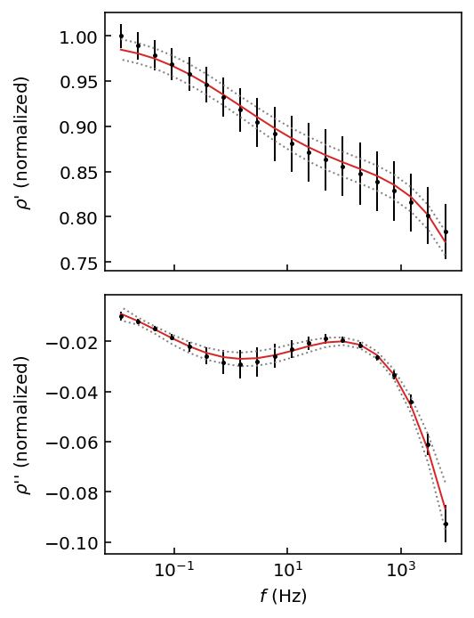

BISIP
=====
**DOCUMENTATION IS UNDER CONSTRUCTION**

**BISIP** is an MIT licensed Python package to perform Bayesian Inversion of
Spectral Induced Polarization data with Markov-chain Monte Carlo simulation.
See our original
`paper <https://ui.adsabs.harvard.edu/abs/2017CG....105...51B/abstract>`_ in
Computers & Geosciences for more details. It should be noted that the original
version of BISIP was built on top of the `PyMC <https://pymc-devs.github.io/pymc/>`_
framework when the code was developed in 2015. Now, BISIP uses
`Goodman & Weare's Affine Invariant Ensemble sampler <https://projecteuclid.org/euclid.camcos/1513731992>`_
as implemented in the `emcee <https://emcee.readthedocs.io/en/stable/>`_ library
to explore the SIP models' parameter spaces with multiple walkers. You can read
the original paper by Foreman-Mackey et al. explaining the emcee algorithm in detail
`here <https://arxiv.org/abs/1202.3665>`_.

BISIP is being developed on `GitHub
<https://github.com/clberube/bisip2>`_.

Basic Usage
-----------

To perform a Debye decomposition inversion of a SIP data file using all
default parameters, you would use the following code:

.. code-block:: python
  :linenos:

  from bisip import PolynomialDecomposition

  # Use one of the example data files provided with BISIP
  filepath = '/path/to/bisip/data/SIP-K389175.dat'

  model = PolynomialDecomposition(filepath)

  # Fit the model to this data file
  model.fit()

  #   Out:  100%|██████████| 1000/1000 [00:01<00:00, 563.92it/s]

  # Plot the fit on top of the input data, discarding the burn-in period
  model.plot_fit(discard=200)

A more detailed example is available in the `Quickstart tutorial`_.

.. _Quickstart tutorial: tutorials/quickstart.ipynb

.. toctree::
   :maxdepth: 2
   :caption: User Guide

   user/install
   user/models
   user/data_format

.. toctree::
   :maxdepth: 1
   :caption: Tutorials

   tutorials/quickstart
   tutorials/pelton
   tutorials/dias
   tutorials/decomposition
   tutorials/shin
